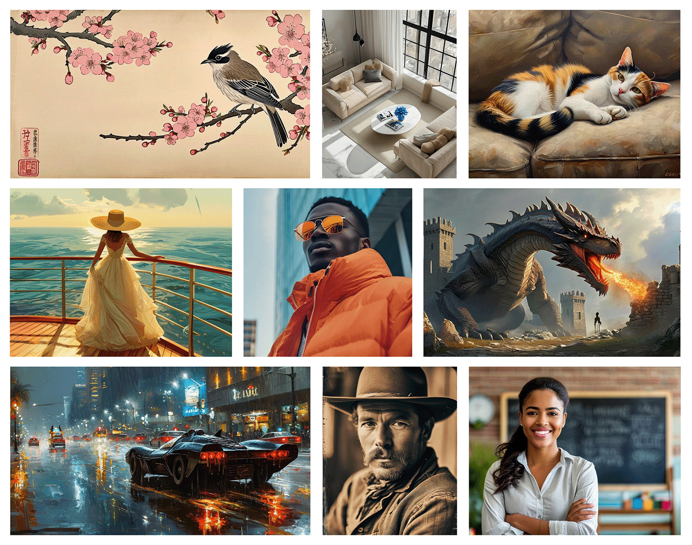
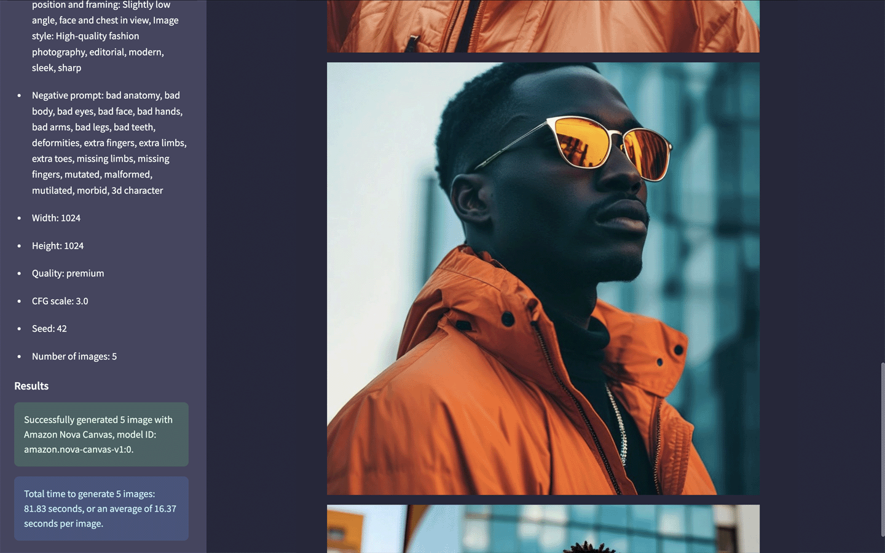

# Amazon Nova Canvas Prompting Assistant

According to [AWS](https://docs.aws.amazon.com/nova/latest/userguide/prompting-image-generation.html), prompting for image generation models differs from prompting for large language models (LLMs).
Image generation models cannot reason or interpret explicit commands.
Therefore, it's best to phrase your prompt as an image caption rather than a command or conversation.
You might want to include details about the subject, action, environment, lighting, style, and camera position.
Additionally, negative prompts help you to exclude objects or style characteristics that might otherwise naturally occur as a result of your main prompt.
Often, it's not about finding a better model, it's about writing better prompts. This Streamlit-based app helps you be mindful of Amazon Nova Canvas' requirements and best practices.

## Features

Features of app include:

### Prompt Parameters

- Prompt Template: Breaks down prompt input into separate optional aspects: subject, action, environment, lighting, style, and camera position
- Prompt Samples: Provide sample prompts as a reference
- Prompt Negation: Checks for the use of negation words in the prompt and issues a warning
- Prompt Length: Confirms the prompt is within the maximum character length
- Negative Prompt Samples: Provide sample negative prompts as a reference

### Image Configuration

- Image Size and Aspect Ratio: Chose from pre-selected image sizes and aspect ratios or input a custom image size
- Image Size: Confirms the image is within the minimum and maximum total pixel size limit
- Image Aspect Ratio: Confirms the image is within the maximum aspect ratio limit
- Image Dimensions: Confirms the image is within the minimum and maximum pixel width and height limits
- Image Display and Saving: Generate, display, and save up to five images per request

## Image Samples

All images shown below were created using this app. No additional post-production cropping or retouching was performed.




## UI Preview





## Amazon Nova References

- [User Guide for Amazon Nova: Amazon Nova Canvas prompting best practices](https://docs.aws.amazon.com/nova/latest/userguide/prompting-image-generation.html)
- [User Guide for Amazon Nova: Sample Code](https://docs.aws.amazon.com/nova/latest/userguide/image-gen-code-examples.html)
- [User Guide for Amazon Nova: Request and response structure for image generation](https://docs.aws.amazon.com/nova/latest/userguide/image-gen-req-resp-structure.html)

## Prerequisites

This app works on Windows, Mac, and Linux OS-based systems. The only prerequisites are a recent version of Python and AWS IAM console access to Amazon Bedrock and the Amazon Nova Canvas model.

## Mac

AWS credentials:

Before starting the application, ensure you have provided your AWS credential on the command line or use an alternative authentication method.

```sh
export AWS_ACCESS_KEY_ID="<YOUR_AWS_ACCESS_KEY_ID>"
export AWS_SECRET_ACCESS_KEY="<YOUR_AWS_SECRET_ACCESS_KEY>"
export AWS_SESSION_TOKEN="<YOUR_AWS_SESSION_TOKEN>"
```

Create a virtual Python environment:

```sh
python --version # I am using Python 3.13.x

python -m pip install virtualenv -U # --break-system-packages
python -m venv .venv
source .venv/bin/activate
```

Install Python package dependencies:

```sh
python -m pip install pip -U
python -m pip install -r requirements.txt -U

streamlit --version
```

Run the Streamlit application:

```sh
streamlit run app.py \
    --server.runOnSave "true" \
    --theme.base "dark" \
    --theme.backgroundColor "#26273B" \
    --theme.primaryColor "#ACADC1" \
    --theme.secondaryBackgroundColor "#454560" \
    --theme.font "sans serif" \
    --ui.hideTopBar "true" \
    --client.toolbarMode "minimal"
```

Deactivate and delete the virtual environment once you are done:

```sh
deactivate
rm -rf .venv
```

## Windows

AWS credentials:

Before starting the application, ensure you have provided your AWS credential on the command line or use an alternative authentication method.

```bat
set AWS_ACCESS_KEY_ID="<YOUR_AWS_ACCESS_KEY_ID>"
set AWS_SECRET_ACCESS_KEY="<YOUR_AWS_SECRET_ACCESS_KEY>"
set AWS_SESSION_TOKEN="<YOUR_AWS_SESSION_TOKEN>"
```

Create a virtual Python environment:

```bat
python --version

python -m venv .venv
.venv\Scripts\activate
```

Install Python package dependencies:

```bat
python -m pip install pip -U
python -m pip install -r requirements.txt -U
```

Run the Streamlit application

```bat
streamlit run app.py `
    --server.runOnSave "true" `
    --theme.base "dark" `
    --theme.backgroundColor "#26273B" `
    --theme.primaryColor "#ACADC1" `
    --theme.secondaryBackgroundColor "#454560" `
    --theme.font "sans serif" `
    --ui.hideTopBar "true" `
    --client.toolbarMode "minimal"
```

Deactivate and delete the virtual environment once you are done:

```bat
deactivate
rm -rf .venv
```

---

_The contents of this repository represent my viewpoints and not of my past or current employers, including Amazon Web Services (AWS). All third-party libraries, modules, plugins, and SDKs are the property of their respective owners._
